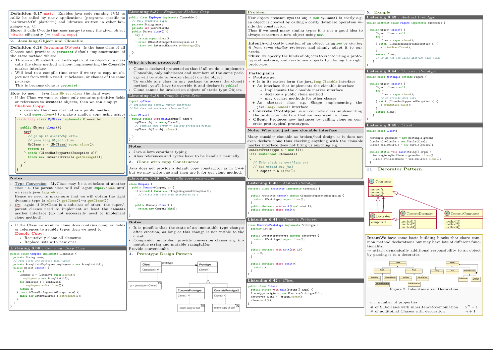

Software Design README:

# Software Design Formulary

This repository contains a LaTeX summary for the "Software Design" formulary. The content of this formulary is based on the course materials from the Software Design lecture at ETH Zurich. The formulary covers various topics in software design, including Java programming, design patterns, and behavioral, structural, and creational patterns.

If you find this formulary helpful, I would appreciate it if you could consider giving it a star ⭐ on GitHub. Your support encourages me to continue creating educational content.

## Course Overview

- **Abstract:** This formulary is based on the undergraduate course "Software Design" at ETH Zurich. The course presents and discusses design patterns regularly used to solve problems in object-oriented design and object-oriented programming. The presented patterns are illustrated with examples from the Java libraries and are applied in a project.

- **Objective:** The students completing this course are expected to:
  - Know the principles of object-oriented programming and can apply these.
  - Know the most important object-oriented design patterns.
  - Apply design patterns to solve design problems.
  - Discover in a given design the use of design patterns.

- **Content:** This course introduces object-oriented programming using Java. However, the main focus is on object-oriented design, particularly design patterns. Design patterns are solutions to recurring design problems. The discussed patterns are illustrated with examples from the Java libraries and are applied in the context of a project.

- **Lecture notes:** No script provided.

- **Literature:**
  - Gamma, Helm, Johnson, Vlissides; Design Patterns: Elements of Reusable Object-Oriented Software; Prentice Hall; ISBN 978-0201633610
  - Freeman, Freeman, Sierra; Head First Design Patterns, Head First Design Patterns; O'Reilly; ISBN 978-0596007126

- **Prerequisites / Notice:** The course "Software Design" is designed for students in the computational sciences program but is open to students of all programs. The precondition is that participants have knowledge in structured programming (e.g., with C, C++, C# or Java).

## Table of Contents

### 1. Introduction to Java Programming
- Java Basics
- Conditional Statements
- Collections in Java
- Object-Oriented Programming in Java

### 2. Behavioral Design Patterns
- Observer/Listener/Publish-Subscriber Pattern
- State Pattern
- Strategy Pattern
- Null Object Pattern
- Composite Pattern
- Prototype Pattern
- Decorator Pattern
- Proxy Pattern
- Command Pattern

### 3. Structural Design Patterns
- (To be added)

### 4. Creational Design Patterns
- (To be added)

## How to Use This Formulary

This formulary is organized by topics, making it easy to navigate and find information quickly. Each section corresponds to a specific aspect of software design or Java programming. Whether you are a beginner or an experienced developer, this formulary aims to be a valuable resource.

If you come across any errors or have suggestions for improvements, please don't hesitate to open an issue or submit a pull request. Your feedback is highly appreciated!

For any questions or clarifications, feel free to [contact me](mailto:your_email@example.com).

Happy coding!
